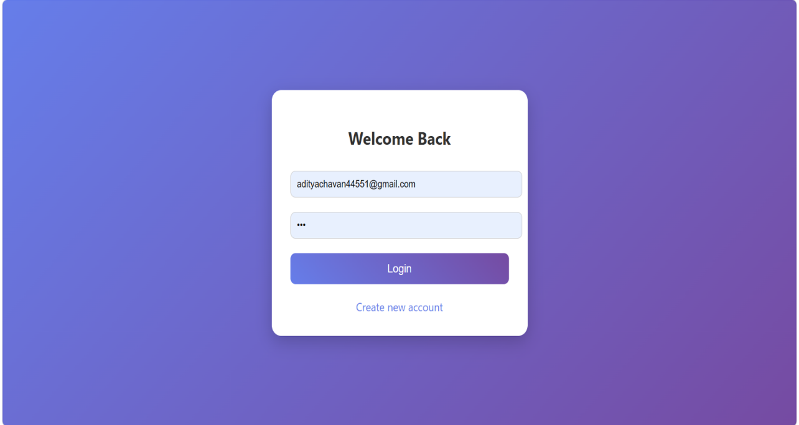
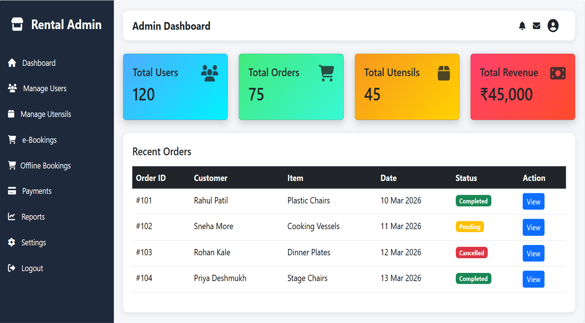
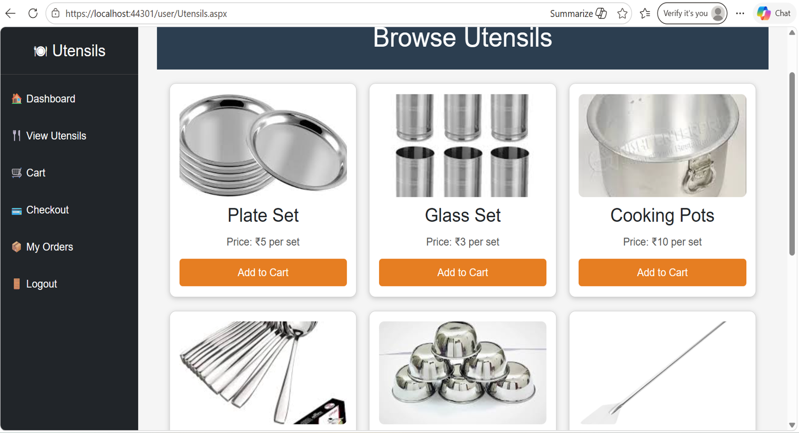
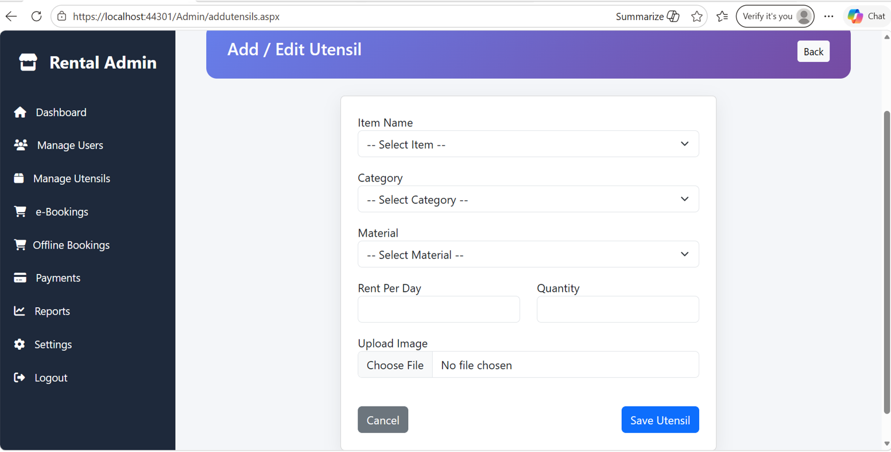
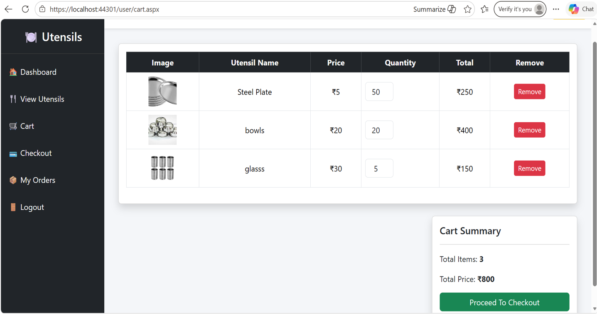
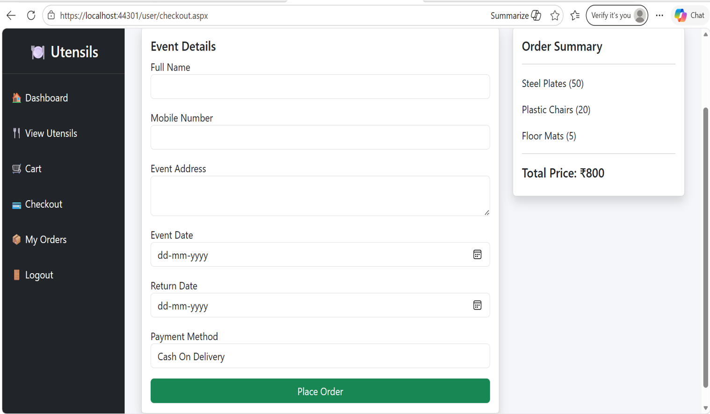
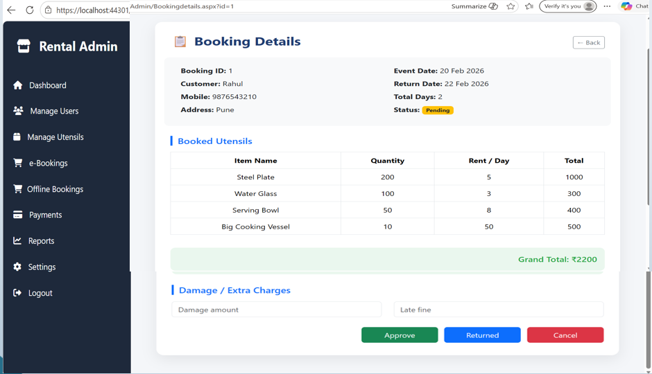

# 🍽️ Online Utensils Rental System

## 📌 Project Overview

Online Utensils Rental System is a web-based application developed to manage the rental of utensils and event-related items digitally. It provides separate Admin and User modules for managing utensils, categories, users, bookings, payments, and orders efficiently.

The project provides an e-commerce-like platform where users can browse available utensils, add items to their cart, place rental orders, and view their bookings.

---

## ✨ Features

- 👤 User Registration & Login
- 🍽️ Browse & View Utensils
- 🛒 Add Utensils to Cart
- 📦 Place Rental Orders
- 💳 Checkout & Payment Management
- 📋 View Booking Details
- 👨‍💼 Admin Dashboard
- 👥 Manage Users
- 🍴 Manage Utensils
- 🗂️ Manage Categories
- 📦 Manage Orders & Bookings
- 📊 Reports Management

---

## 🛠️ Technologies Used

- ASP.NET
- C#
- HTML
- CSS
- Bootstrap
- MySQL
- XAMPP
- phpMyAdmin
- Visual Studio

---

## 🗂️ Modules

### 👨‍💼 Admin Module

- Admin Dashboard
- User Management
- Utensil Management
- Category Management
- Order Management
- Booking Management
- Payment Management
- Reports

### 👤 User Module

- User Registration
- User Login
- User Dashboard
- View Utensils
- Add to Cart
- Cart Management
- Checkout
- Place Rental Orders
- My Bookings

---

## 📸 Screenshots

### 🔐 Login Page

### 📊 Admin Dashboard

### 👤 User Dashboard

### 🍽️ Add Utensils

### 🛒 Add to Cart

### 💳 Checkout

### 📦 Booking Details

---

## 🗄️ Database

MySQL database is used to store:

- User Details
- Utensil Details
- Category Information
- Order Details
- Booking Records
- Payment Details

The database is managed using **XAMPP and phpMyAdmin**.

---

## ⚙️ How to Run

1. Open the project in Visual Studio.
2. Start Apache and MySQL using XAMPP.
3. Open phpMyAdmin.
4. Create the required database.
5. Import the project SQL database.
6. Configure the database connection.
7. Build and run the application.

---

## 🚀 Future Enhancements

- Online Payment Gateway
- Booking Confirmation Notifications
- Email/SMS Notifications
- Customer Reviews & Ratings
- Advanced Rental Reports
- Automated Invoice Generation

---

## 👩‍💻 Author

**Pooja Chavan**

BCA Graduate | Data Analytics Learner

### Skills

ASP.NET • C# • MySQL • SQL • HTML • CSS • Bootstrap • Java • Python • Excel • Power BI • Git • GitHub

### GitHub

https://github.com/poojachavan8225
